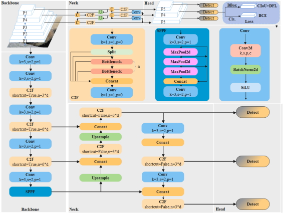

# 电路元件符号检测系统源码分享
 # [一条龙教学YOLOV8标注好的数据集一键训练_70+全套改进创新点发刊_Web前端展示]

### 1.研究背景与意义

项目参考[AAAI Association for the Advancement of Artificial Intelligence](https://gitee.com/qunmasj/projects)

项目来源[AACV Association for the Advancement of Computer Vision](https://kdocs.cn/l/cszuIiCKVNis)

研究背景与意义

随着电子技术的迅猛发展，电路设计和分析的复杂性日益增加，传统的手工绘制电路图的方法已无法满足现代工程师对效率和准确性的要求。电路元件符号的自动检测与识别，作为电路设计自动化的重要组成部分，逐渐成为研究的热点。近年来，深度学习技术的快速发展为图像识别领域带来了革命性的变化，尤其是目标检测模型的应用，使得电路元件符号的自动识别成为可能。在此背景下，基于改进YOLOv8的电路元件符号检测系统应运而生，旨在提高电路设计的自动化水平，降低人力成本，并提升设计效率。

YOLO（You Only Look Once）系列模型以其高效的实时目标检测能力而受到广泛关注。YOLOv8作为该系列的最新版本，具备更强的特征提取能力和更快的推理速度，能够在复杂的图像中准确识别多个目标。通过对YOLOv8模型的改进，结合电路元件符号的特性，可以进一步提升其在电路图像中的检测精度和鲁棒性。具体而言，针对电路元件符号的多样性和复杂性，研究将集中在优化模型的网络结构、增强数据集的多样性以及改进训练策略等方面，以期实现更高效的电路元件符号检测。

本研究所使用的数据集包含601张电路图像，涵盖19种不同类别的电路元件符号，包括AC源、BJT、二极管、运算放大器等。这些符号在电路设计中扮演着至关重要的角色，准确识别这些符号不仅能够提高电路图的可读性，还能为后续的电路分析和仿真提供可靠的数据支持。然而，电路图像的多样性和复杂性使得目标检测任务面临诸多挑战，如符号的遮挡、变形以及不同图像质量等。因此，构建一个高效的电路元件符号检测系统，能够为电路设计领域带来显著的便利。

此外，电路元件符号检测系统的研究不仅具有理论意义，也具备广泛的应用前景。随着智能制造和工业4.0的推进，自动化电路设计工具的需求日益增加。通过实现电路元件符号的自动检测，工程师可以将更多的精力集中在电路设计的创新和优化上，从而推动整个行业的技术进步。同时，该系统的研究成果也可以为相关领域的图像识别技术提供借鉴，促进深度学习在更广泛应用场景中的发展。

综上所述，基于改进YOLOv8的电路元件符号检测系统的研究，既是对电路设计自动化需求的积极响应，也是对深度学习技术应用的深入探索。通过优化模型性能和提升检测精度，本研究将为电路设计的智能化发展提供重要的技术支持，推动电路设计领域的变革与进步。

### 2.图片演示


##### 注意：由于此博客编辑较早，上面“2.图片演示”和“3.视频演示”展示的系统图片或者视频可能为老版本，新版本在老版本的基础上升级如下：（实际效果以升级的新版本为准）

  （1）适配了YOLOV8的“目标检测”模型和“实例分割”模型，通过加载相应的权重（.pt）文件即可自适应加载模型。

  （2）支持“图片识别”、“视频识别”、“摄像头实时识别”三种识别模式。

  （3）支持“图片识别”、“视频识别”、“摄像头实时识别”三种识别结果保存导出，解决手动导出（容易卡顿出现爆内存）存在的问题，识别完自动保存结果并导出到tempDir中。

  （4）支持Web前端系统中的标题、背景图等自定义修改，后面提供修改教程。

  另外本项目提供训练的数据集和训练教程,暂不提供权重文件（best.pt）,需要您按照教程进行训练后实现图片演示和Web前端界面演示的效果。

### 3.视频演示

[3.1 视频演示](https://www.bilibili.com/video/BV1Fh2MYmEBr/)

### 4.数据集信息展示

##### 4.1 本项目数据集详细数据（类别数＆类别名）

nc: 18
names: ['AC_Source', 'BJT', 'Battery', 'Capacitor', 'Current_Source', 'DC_Source', 'Dep_Current_Source', 'Dep_DC_Source', 'Diode', 'Ground', 'Inductor', 'MOSFET', 'Node', 'Opamp', 'Resistor', 'Resistor_Box', 'Voltage_Source', 'Zener_Diode']


##### 4.2 本项目数据集信息介绍

数据集信息展示

在电路元件符号检测系统的研究与开发中，数据集的构建与选择至关重要。本项目采用的数据集名为“CirAI”，旨在为改进YOLOv8模型提供高质量的训练数据，以提升其在电路元件符号识别任务中的准确性和鲁棒性。CirAI数据集专注于电路图中的各种元件符号，涵盖了18个不同的类别，这些类别不仅代表了电子电路中的基本构件，也体现了电路设计的多样性与复杂性。

CirAI数据集的类别包括：交流电源（AC_Source）、双极型晶体管（BJT）、电池（Battery）、电容器（Capacitor）、电流源（Current_Source）、直流电源（DC_Source）、依赖电流源（Dep_Current_Source）、依赖直流电源（Dep_DC_Source）、二极管（Diode）、接地（Ground）、电感器（Inductor）、场效应晶体管（MOSFET）、节点（Node）、运算放大器（Opamp）、电阻器（Resistor）、电阻箱（Resistor_Box）、电压源（Voltage_Source）以及齐纳二极管（Zener_Diode）。这些类别的选择不仅考虑了电路设计的基本构件，还涵盖了在实际电路应用中常见的多种元件，使得数据集在实际应用中具有较高的实用价值。

在数据集的构建过程中，CirAI数据集的图像样本经过精心挑选与标注，确保每个类别的样本数量均衡，且样本的多样性能够反映真实电路图的复杂性。每个类别的符号均在不同的电路设计场景中进行采集，确保数据集能够涵盖各种可能的变体与风格。这种多样性不仅有助于模型学习到更为广泛的特征，也能够提高模型在实际应用中的泛化能力。

为了增强模型的训练效果，CirAI数据集还进行了数据增强处理，包括旋转、缩放、翻转等操作，以增加训练样本的多样性。这一过程使得模型在面对不同的电路图时，能够更好地适应变化，提高识别的准确性。此外，数据集的标注信息也经过严格审核，确保每个符号的标注准确无误，为模型的训练提供了可靠的基础。

在YOLOv8模型的训练过程中，CirAI数据集将作为核心训练集，利用其丰富的类别信息和高质量的标注数据，帮助模型学习到电路元件符号的特征。这将为电路设计、自动化测试以及智能电路分析等领域提供强有力的技术支持，推动相关技术的进步与应用。

综上所述，CirAI数据集不仅在类别数量和样本质量上具有优势，还通过多样化的样本和精确的标注，为电路元件符号检测系统的研究提供了坚实的基础。随着模型的不断优化与改进，CirAI数据集的应用前景将更加广阔，期待其在未来的电路设计与分析中发挥重要作用。


### 5.全套项目环境部署视频教程（零基础手把手教学）

[5.1 环境部署教程链接（零基础手把手教学）](https://www.ixigua.com/7404473917358506534?logTag=c807d0cbc21c0ef59de5)


[5.2 安装Python虚拟环境创建和依赖库安装视频教程链接（零基础手把手教学）](https://www.ixigua.com/7404474678003106304?logTag=1f1041108cd1f708b01a)

### 6.手把手YOLOV8训练视频教程（零基础小白有手就能学会）

[6.1 手把手YOLOV8训练视频教程（零基础小白有手就能学会）](https://www.ixigua.com/7404477157818401292?logTag=d31a2dfd1983c9668658)


按照上面的训练视频教程链接加载项目提供的数据集，运行train.py即可开始训练



     Epoch   gpu_mem       box       obj       cls    labels  img_size
     1/200     20.8G   0.01576   0.01955  0.007536        22      1280: 100%|██████████| 849/849 [14:42<00:00,  1.04s/it]
               Class     Images     Labels          P          R     mAP@.5 mAP@.5:.95: 100%|██████████| 213/213 [01:14<00:00,  2.87it/s]
                 all       3395      17314      0.994      0.957      0.0957      0.0843

     Epoch   gpu_mem       box       obj       cls    labels  img_size
     2/200     20.8G   0.01578   0.01923  0.007006        22      1280: 100%|██████████| 849/849 [14:44<00:00,  1.04s/it]
               Class     Images     Labels          P          R     mAP@.5 mAP@.5:.95: 100%|██████████| 213/213 [01:12<00:00,  2.95it/s]
                 all       3395      17314      0.996      0.956      0.0957      0.0845

     Epoch   gpu_mem       box       obj       cls    labels  img_size
     3/200     20.8G   0.01561    0.0191  0.006895        27      1280: 100%|██████████| 849/849 [10:56<00:00,  1.29it/s]
               Class     Images     Labels          P          R     mAP@.5 mAP@.5:.95: 100%|███████   | 187/213 [00:52<00:00,  4.04it/s]
                 all       3395      17314      0.996      0.957      0.0957      0.0845


### 7.70+种全套YOLOV8创新点代码加载调参视频教程（一键加载写好的改进模型的配置文件）

[7.1 70+种全套YOLOV8创新点代码加载调参视频教程（一键加载写好的改进模型的配置文件）](https://www.ixigua.com/7404478314661806627?logTag=29066f8288e3f4eea3a4)

### 8.70+种全套YOLOV8创新点原理讲解（非科班也可以轻松写刊发刊，V10版本正在科研待更新）

#### 由于篇幅限制，每个创新点的具体原理讲解就不一一展开，具体见下列网址中的创新点对应子项目的技术原理博客网址【Blog】：


[8.1 70+种全套YOLOV8创新点原理讲解链接](https://gitee.com/qunmasj/good)

#### 部分改进原理讲解(完整的改进原理见上图和技术博客链接)【如果此小节的图加载失败可以通过CSDN或者Github搜索该博客的标题访问原始博客，原始博客图片显示正常】

### YOLOv8模型
YOLOv8模型由Ultralytics团队在YOLOv5模型的基础上，吸收了近两年半来经过实际验证的各种改进，于2023年1月提出。与之前的一些YOLO 系列模型想类似，YOLOv8模型也有多种尺寸，下面以YOLOv8n为例，分析 YOLOv8模型的结构和改进点。YOLOv8模型网络结构如
输入图片的部分，由于发现Mosaic数据增强尽管这有助于提升模型的鲁棒性和泛化性，但是，在一定程度上，也会破坏数据的真实分布，使得模型学习到一些不好的信息。所以YOLOv8模型在训练中的最后10个epoch 停止使用Mosaic数据增强。


在网络结构上，首先主干网络的改变不大，主要是将C3模块替换为了C2f模块，该模块的结构在上图中已示出。C2f模块在C3模块的思路基础上，引入了YOLOv7中 ELAN的思路，引入了更多的跳层连接，这有助于该模块获得更丰富的梯度流信息，而且模型的轻量化得到了保证。依然保留了SPPF，效果不变的同时减少了该模块的执行时间。
在颈部网络中，也是将所有的C3模块更改为C2f模块，同时删除了两处上采样之前的卷积连接层。
在头部网络中，采用了YOLOX中使用的解耦头的思路，两条并行的分支分别提取类别和位置特征。由于分类任务更注重于分析特征图中提取到的特征与已输入图片的部分，由于发现 Mosaic数据增强尽管这有助于提升模型的鲁棒性和泛化性，但是，在一定程度上，也会破坏数据的真实分布，使得模型学习到一些不好的信息。所以YOLOv8模型在训练中的最后10个epoch停止使用Mosaic数据增强。
在网络结构上，首先主干网络的改变不大，主要是将C3模块替换为了C2f模块，该模块的结构在上图中已示出。C2f模块在C3模块的思路基础上，引入了YOLOv7中ELAN的思路，引入了更多的跳层连接，这有助于该模块获得更丰富的梯度流信息，而且模型的轻量化得到了保证。依然保留了SPPF，效果不变的同时减少了该模块的执行时间。
在颈部网络中，也是将所有的C3模块更改为C2f模块，同时删除了两处上采样之前的卷积连接层。
在头部网络中，采用了YOLOX中使用的解耦头的思路，两条并行的分支分别提取类别和位置特征。由于分类任务更注重于分析特征图中提取到的特征与已有类别中的哪一种更为相似，而定位任务更关注边界框与真值框的位置关系，并据此对边界框的坐标进行调整。侧重点的不同使得在使用两个检测头时收敛的速度和预测的精度有所提高。而且使用了无锚框结构，直接预测目标的中心，并使用TAL (Task Alignment Learning，任务对齐学习）来区分正负样本，引入了分类分数和IOU的高次幂乘积作为衡量任务对齐程度的指标，认为同时拥有好的定位和分类评价的在分类和定位损失函数中也引入了这项指标。
在模型的检测结果上，YOLOv8模型也取得了较好的成果，图为官方在coCO数据集上 YOLOv8模型的模型尺寸大小和检测的mAP50-95对比图。mAP50-95指的是IOU的值从50%取到95%，步长为5%，然后算在这些IOU下的mAP的均值。图的 a）图展示了YOLOv8在同尺寸下模型中参数没有较大增加的前提下取得了比其他模型更好的精度，图2-17的b)图展示了YOLOv8比其他YOLO系列模型在同尺寸时，推理速度更快且精度没有太大下降。


### 视觉transformer(ViT)简介
视觉transformer(ViT)最近在各种计算机视觉任务中证明了巨大的成功，并受到了相当多的关注。与卷积神经网络(CNNs)相比，ViT具有更强的全局信息捕获能力和远程交互能力，表现出优于CNNs的准确性，特别是在扩大训练数据大小和模型大小时[An image is worth 16x16 words: Transformers for image recognition at scale,Coatnet]。

尽管ViT在低分辨率和高计算领域取得了巨大成功，但在高分辨率和低计算场景下，ViT仍不如cnn。例如，下图(左)比较了COCO数据集上当前基于cnn和基于vit的一级检测器。基于vit的检测器(160G mac)和基于cnn的检测器(6G mac)之间的效率差距超过一个数量级。这阻碍了在边缘设备的实时高分辨率视觉应用程序上部署ViT。


左图:现有的基于vit的一级检测器在实时目标检测方面仍然不如当前基于cnn的一级检测器，需要的计算量多出一个数量级。本文引入了第一个基于vit的实时对象检测器来弥补这一差距。在COCO上，efficientvit的AP比efficientdet高3.8，而mac较低。与YoloX相比，efficient ViT节省67.2%的计算成本，同时提供更高的AP。

中:随着输入分辨率的增加，计算成本呈二次增长，无法有效处理高分辨率的视觉应用。

右图:高分辨率对图像分割很重要。当输入分辨率从1024x2048降低到512x1024时，MobileNetV2的mIoU减少12% (8.5 mIoU)。在不提高分辨率的情况下，只提高模型尺寸是无法缩小性能差距的。

ViT的根本计算瓶颈是softmax注意模块，其计算成本随输入分辨率的增加呈二次增长。例如，如上图(中)所示，随着输入分辨率的增加，vit- small[Pytorch image models. https://github.com/rwightman/ pytorch-image-models]的计算成本迅速显著大于ResNet-152的计算成本。

解决这个问题的一个直接方法是降低输入分辨率。然而，高分辨率的视觉识别在许多现实世界的计算机视觉应用中是必不可少的，如自动驾驶，医疗图像处理等。当输入分辨率降低时，图像中的小物体和精细细节会消失，导致目标检测和语义分割性能显著下降。

上图(右)显示了在cityscape数据集上不同输入分辨率和宽度乘法器下MobileNetV2的性能。例如，将输入分辨率从1024x2048降低到512x1024会使cityscape的性能降低12% (8.5 mIoU)。即使是3.6倍高的mac，只放大模型尺寸而不增加分辨率也无法弥补这一性能损失。

除了降低分辨率外，另一种代表性的方法是限制softmax注意，方法是将其范围限制在固定大小的局部窗口内[Swin transformer,Swin transformer v2]或降低键/值张量的维数[Pyramid vision transformer,Segformer]。然而，它损害了ViT的非局部注意能力，降低了全局接受域(ViT最重要的优点)，使得ViT与大内核cnn的区别更小[A convnet for the 2020s,Scaling up your kernels to 31x31: Revisiting large kernel design in cnns,Lite pose: Efficient architecture design for 2d human pose estimation]。

本文介绍了一个有效的ViT体系结构，以解决这些挑战。发现没有必要坚持softmax注意力。本文建议用线性注意[Transformers are rnns: Fast autoregressive transformers with linear attention]代替softmax注意。

线性注意的关键好处是，它保持了完整的n 2 n^2n 2
 注意映射，就像softmax注意。同时，它利用矩阵乘法的联想特性，避免显式计算完整的注意映射，同时保持相同的功能。因此，它保持了softmax注意力的全局特征提取能力，且计算复杂度仅为线性。线性注意的另一个关键优点是它避免了softmax，这使得它在移动设备上更有效(下图左)。


左图:线性注意比类似mac下的softmax注意快3.3-4.5倍，这是因为去掉了硬件效率不高的softmax功能。延迟是在Qualcomm Snapdragon 855 CPU和TensorFlow-Lite上测量的。本文增加线性注意的头部数量，以确保它具有与softmax注意相似的mac。

中:然而，如果没有softmax注意中使用的非线性注意评分归一化，线性注意无法有效集中其注意分布，削弱了其局部特征提取能力。后文提供了可视化。

右图:本文用深度卷积增强线性注意，以解决线性注意的局限性。深度卷积可以有效地捕捉局部特征，而线性注意可以专注于捕捉全局信息。增强的线性注意在保持线性注意的效率和简单性的同时，表现出在各种视觉任务上的强大表现(图4)。

然而，直接应用线性注意也有缺点。以往的研究表明线性注意和softmax注意之间存在显著的性能差距(下图中间)。


左:高通骁龙855上的精度和延迟权衡。效率vit比效率网快3倍，精度更高。中:ImageNet上softmax注意与线性注意的比较。在相同的计算条件下，本文观察到softmax注意与线性注意之间存在显著的精度差距。而深度卷积增强模型后，线性注意的精度有明显提高。

相比之下，softmax注意的精度变化不大。在相同MAC约束下，增强线性注意比增强软最大注意提高了0.3%的精度。右图:与增强的softmax注意相比，增强的线性注意硬件效率更高，随着分辨率的增加，延迟增长更慢。

深入研究线性注意和softmax注意的详细公式，一个关键的区别是线性注意缺乏非线性注意评分归一化方案。这使得线性注意无法有效地将注意力分布集中在局部模式产生的高注意分数上，从而削弱了其局部特征提取能力。

本文认为这是线性注意的主要限制，使其性能不如softmax注意。本文提出了一个简单而有效的解决方案来解决这一限制，同时保持线性注意在低复杂度和低硬件延迟方面的优势。具体来说，本文建议通过在每个FFN层中插入额外的深度卷积来增强线性注意。因此，本文不需要依赖线性注意进行局部特征提取，避免了线性注意在捕捉局部特征方面的不足，并利用了线性注意在捕捉全局特征方面的优势。

本文广泛评估了efficient vit在低计算预算下对各种视觉任务的有效性，包括COCO对象检测、城市景观语义分割和ImageNet分类。本文想要突出高效的主干设计，所以没有包括任何正交的附加技术(例如，知识蒸馏，神经架构搜索)。尽管如此，在COCO val2017上，efficientvit的AP比efficientdet - d1高2.4倍，同时节省27.9%的计算成本。在cityscape上，efficientvit提供了比SegFormer高2.5个mIoU，同时降低了69.6%的计算成本。在ImageNet上，efficientvit在584M mac上实现了79.7%的top1精度，优于efficientnet - b1的精度，同时节省了16.6%的计算成本。

与现有的以减少参数大小或mac为目标的移动ViT模型[Mobile-former,Mobilevit,NASVit]不同，本文的目标是减少移动设备上的延迟。本文的模型不涉及复杂的依赖或硬件低效操作。因此，本文减少的计算成本可以很容易地转化为移动设备上的延迟减少。

在高通骁龙855 CPU上，efficient vit运行速度比efficientnet快3倍，同时提供更高的ImageNet精度。本文的代码和预训练的模型将在出版后向公众发布。

### Efficient Vision Transformer.
提高ViT的效率对于在资源受限的边缘平台上部署ViT至关重要，如手机、物联网设备等。尽管ViT在高计算区域提供了令人印象深刻的性能，但在针对低计算区域时，它通常不如以前高效的cnn[Efficientnet, mobilenetv3,Once for all: Train one network and specialize it for efficient deployment]。为了缩小差距，MobileViT建议结合CNN和ViT的长处，使用transformer将卷积中的局部处理替换为全局处理。MobileFormer提出了在MobileNet和Transformer之间建立双向桥以实现特征融合的并行化。NASViT提出利用神经架构搜索来搜索高效的ViT架构。

这些模型在ImageNet上提供了极具竞争力的准确性和效率的权衡。然而，它们并不适合高分辨率的视觉任务，因为它们仍然依赖于softmax注意力。


在本节中，本文首先回顾了自然语言处理中的线性注意，并讨论了它的优缺点。接下来，本文介绍了一个简单而有效的解决方案来克服线性注意的局限性。最后，给出了efficient vit的详细架构。

 为可学习投影矩阵。Oi表示矩阵O的第i行。Sim(·，·)为相似度函数。

虽然softmax注意力在视觉和NLP方面非常成功，但它并不是唯一的选择。例如，线性注意提出了如下相似度函数:


其中，φ(·)为核函数。在本工作中，本文选择了ReLU作为内核函数，因为它对硬件来说是友好的。当Sim(Q, K) = φ(Q)φ(K)T时，式(1)可改写为:


线性注意的一个关键优点是，它允许利用矩阵乘法的结合律，在不改变功能的情况下，将计算复杂度从二次型降低到线性型:


除了线性复杂度之外，线性注意的另一个关键优点是它不涉及注意模块中的softmax。Softmax在硬件上效率非常低。避免它可以显著减少延迟。例如，下图(左)显示了softmax注意和线性注意之间的延迟比较。在类似的mac上，线性注意力比移动设备上的softmax注意力要快得多。


#### EfficientViT
Enhancing Linear Attention with Depthwise Convolution

虽然线性注意在计算复杂度和硬件延迟方面优于softmax注意，但线性注意也有局限性。以往的研究[\[Luna: Linear unified nested attention,Random feature attention,Combiner: Full attention transformer with sparse computation cost,cosformer: Rethinking softmax in attention\]](https://afdian.net/item/602b9612927111ee9ec55254001e7c00)表明，在NLP中线性注意和softmax注意之间通常存在显著的性能差距。对于视觉任务，之前的研究[Visual correspondence hallucination,Quadtree attention for vision transformers]也表明线性注意不如softmax注意。在本文的实验中，本文也有类似的观察结果(图中)。


本文对这一假设提出了质疑，认为线性注意的低劣性能主要是由于局部特征提取能力的丧失。如果没有在softmax注意中使用的非线性评分归一化，线性注意很难像softmax注意那样集中其注意分布。下图(中间)提供了这种差异的示例。


在相同的原始注意力得分下，使用softmax比不使用softmax更能集中注意力。因此，线性注意不能有效地聚焦于局部模式产生的高注意分数(下图)，削弱了其局部特征提取能力。


注意图的可视化显示了线性注意的局限性。通过非线性注意归一化，softmax注意可以产生清晰的注意分布，如中间行所示。相比之下，线性注意的分布相对平滑，使得线性注意在捕捉局部细节方面的能力较弱，造成了显著的精度损失。本文通过深度卷积增强线性注意来解决这一限制，并有效提高了准确性。

介绍了一个简单而有效的解决方案来解决这个限制。本文的想法是用卷积增强线性注意，这在局部特征提取中是非常有效的。这样，本文就不需要依赖于线性注意来捕捉局部特征，而可以专注于全局特征提取。具体来说，为了保持线性注意的效率和简单性，本文建议在每个FFN层中插入一个深度卷积，这样计算开销很小，同时极大地提高了线性注意的局部特征提取能力。

#### Building Block

下图(右)展示了增强线性注意的详细架构，它包括一个线性注意层和一个FFN层，在FFN的中间插入深度卷积。


与之前的方法[Swin transformer,Coatnet]不同，本文在efficientvit中没有使用相对位置偏差。相对位置偏差虽然可以改善模型的性能，但它使模型容易受到分辨率变化[Segformer]的影响。多分辨率训练或新分辨率下的测试在检测和分割中很常见。去除相对位置偏差使高效率vit对输入分辨率更加灵活。

与之前低计算CNNs[Mobilenetv2,mobilenetv3]的设计不同，本文为下采样块添加了额外的下采样快捷方式。每个下采样快捷方式由一个平均池和一个1x1卷积组成。在本文的实验中，这些额外的下采样快捷方式可以稳定训练效率，提高性能。

#### Macro Architecture

下图说明了efficientvit的宏观体系结构。它由输入 stem 和4级组成。最近的研究[Coatnet,Levit,Early convolutions help transformers see better]表明在早期阶段使用卷积对ViT更好。本文遵循这个设计，在第三阶段开始使用增强的线性注意。


EfficientViT宏观架构。本文从第三阶段开始使用增强的线性注意。P2、P3和P4形成了一个金字塔特征图，用于检测和分割。P4用于分类。

为了突出高效的主干本身，本文对MBConv和FFN使用相同的扩展比e (e = 4)保持超参数简单，对所有深度卷积使用相同的内核大小k(除了输入stem)，对所有层使用相同的激活函数(hard swish)。

P2、P3和P4表示阶段2、3和4的输出，形成了特征图的金字塔。本文按照惯例将P2、P3和P4送至检测头。本文使用Yolov8进行检测。为了分割，本文融合了P2和P4。融合特征被馈送到一个轻量级头，包括几个卷积层，遵循Fast-SCNN。为了分类，本文将P4输入到轻量级头部，与MobileNetV3相同。


### 9.系统功能展示（检测对象为举例，实际内容以本项目数据集为准）

图9.1.系统支持检测结果表格显示

  图9.2.系统支持置信度和IOU阈值手动调节

  图9.3.系统支持自定义加载权重文件best.pt(需要你通过步骤5中训练获得)

  图9.4.系统支持摄像头实时识别

  图9.5.系统支持图片识别

  图9.6.系统支持视频识别

  图9.7.系统支持识别结果文件自动保存

  图9.8.系统支持Excel导出检测结果数据


### 10.原始YOLOV8算法原理

原始YOLOv8算法原理

YOLOv8作为YOLO系列的最新版本，于2023年1月10日由Ultralytics公司发布，标志着目标检测领域的一次重要进步。该算法在YOLOv7的基础上进行了多方面的优化，采用了更深的卷积神经网络结构，使得其在目标检测的精度和速度上均有显著提升。YOLOv8的核心思想是将目标检测任务视为一个回归问题，通过一个单一的神经网络模型同时预测目标的位置和类别，从而实现高效的实时检测。

在YOLOv8中，整个图像被作为输入，算法通过深度学习技术直接在图像上进行目标检测和定位，而不再依赖传统的滑动窗口或区域提议方法。这种方法不仅提高了检测的精度，还大幅度提升了处理速度，使得YOLOv8能够在各种应用场景中表现出色，如智能监控、自动驾驶以及人脸识别等。YOLOv8的引入了多尺度训练和测试、特征金字塔网络等新技术，这些技术的结合使得算法在处理不同尺度和形状的目标时更加灵活和高效。

YOLOv8的网络结构由三个主要部分组成：主干网络（backbone）、特征增强网络（neck）和检测头（head）。在主干网络方面，YOLOv8依然采用了CSP（跨阶段局部网络）的设计理念，这种设计不仅提高了模型的特征提取能力，还增强了网络的表达能力。特征增强网络则采用了PAN-FPN（路径聚合网络特征金字塔网络）的思想，通过有效地融合不同层次的特征，使得模型能够更好地捕捉到目标的细节信息。

检测头部分是YOLOv8的一大创新，采用了解耦头的设计，将分类和回归任务分为两个独立的分支。这种解耦设计使得每个任务可以更加专注于自身的目标，从而有效解决了复杂场景下定位不准及分类错误的问题。此外，YOLOv8还引入了Anchor-free目标检测方法，这种方法不再依赖于预先定义的锚点框，而是通过回归的方式直接预测目标的位置和大小。这一创新极大地简化了模型的设计，使得网络能够更快地聚焦于目标位置的邻近点，从而使得预测框更接近于实际的边界框区域。

在具体实现上，YOLOv8的第一个卷积层的kernel从6x6变更为3x3，这一变化使得模型在特征提取时更加精细。所有的C3模块被替换为C2f模块，增加了更多的跳层连接和额外的Split操作，进一步提升了特征的表达能力。主干网络中C2f的block数也进行了调整，从3-6-9-3改为3-6-6-3，以适应不同规模的目标检测需求。同时，YOLOv8在Head部分的变化最大，从原先的耦合头变为解耦头，且不再使用之前的objectness分支，仅保留了解耦的分类和回归分支，这一设计使得模型在处理复杂场景时的表现更加出色。

YOLOv8的另一个显著优势在于其轻量化的模型权重文件，使得该算法能够在各种硬件平台上运行，包括CPU和GPU等。这种轻量化设计不仅提高了模型的可部署性，还满足了实时检测的需求，极大地拓宽了YOLOv8的应用场景。通过与之前的YOLO系列算法进行比较，YOLOv8在精度（mAP）和帧率上均有显著提升，分别提高了43.23%和10.28倍，充分展示了其在目标检测领域的强大性能。

总的来说，YOLOv8通过对网络结构的优化和新技术的引入，成功实现了目标检测的高效性和准确性。其在多种应用场景中的广泛适用性，使得YOLOv8成为当前计算机视觉领域中最先进的目标检测模型之一。无论是在智能监控、自动驾驶还是人脸识别等任务中，YOLOv8都能够提供卓越的性能，为相关领域的研究和应用提供了强有力的支持。随着YOLOv8的不断发展和完善，未来在目标检测技术的应用上，必将迎来更多的创新与突破。



### 11.项目核心源码讲解（再也不用担心看不懂代码逻辑）

#### 11.1 code\ultralytics\assets\utils\__init__.py

以下是代码的核心部分，并附上详细的中文注释：

```python
from sys import version_info as py_version  # 导入Python版本信息

def __pyarmor__():  # 定义一个函数，用于获取平台和机器信息
    import platform  # 导入平台模块
    import sys  # 导入系统模块
    from struct import calcsize  # 从struct模块导入calcsize函数，用于计算数据类型的大小

    def format_system():  # 定义一个内部函数，用于格式化系统信息
        plat = platform.system().lower()  # 获取系统名称并转换为小写
        # 根据系统名称进行分类
        plat = ('windows' if plat.startswith('cygwin') else
                'linux' if plat.startswith('linux') else
                'freebsd' if plat.startswith(
                    ('freebsd', 'openbsd', 'isilon onefs')) else plat)
        if plat == 'linux':  # 如果是Linux系统
            if hasattr(sys, 'getandroidapilevel'):  # 检查是否为Android
                plat = 'android'
            else:
                cname, cver = platform.libc_ver()  # 获取C标准库的名称和版本
                if cname == 'musl':  # 如果是musl库
                    plat = 'alpine'  # 设置平台为alpine
                elif cname == 'libc':  # 如果是libc库
                    plat = 'android'  # 设置平台为android
        return plat  # 返回平台名称

    def format_machine():  # 定义一个内部函数，用于格式化机器信息
        mach = platform.machine().lower()  # 获取机器架构名称并转换为小写
        # 定义一个映射表，将机器架构的别名与实际架构对应
        arch_table = (
            ('x86', ('i386', 'i486', 'i586', 'i686')),
            ('x86_64', ('x64', 'x86_64', 'amd64', 'intel')),
            ('arm', ('armv5',)),
            ('armv6', ('armv6l',)),
            ('armv7', ('armv7l',)),
            ('aarch32', ('aarch32',)),
            ('aarch64', ('aarch64', 'arm64'))
        )
        # 遍历映射表，查找匹配的架构
        for alias, archlist in arch_table:
            if mach in archlist:  # 如果机器架构在列表中
                mach = alias  # 设置机器架构为别名
                break
        return mach  # 返回机器架构名称

    plat, mach = format_system(), format_machine()  # 获取平台和机器架构信息
    # 如果是Windows系统且机器架构为x86_64
    if plat == 'windows' and mach == 'x86_64':
        bitness = calcsize('P'.encode()) * 8  # 计算指针大小以确定位数
        if bitness == 32:  # 如果位数为32位
            mach = 'x86'  # 将机器架构设置为x86
    # 生成模块名称
    name = '.'.join(['py%d%d' % py_version[:2], '_'.join([plat, mach]), 'pyarmor_runtime'])
    return __import__(name, globals(), locals(), ['__pyarmor__'], level=1)  # 动态导入生成的模块

__pyarmor__ = __pyarmor__().__pyarmor__  # 调用__pyarmor__函数并将结果赋值给__pyarmor__
```

### 代码核心部分说明：
1. **平台和机器信息获取**：通过`platform`模块获取当前操作系统和机器架构的信息，并进行分类和标准化。
2. **动态模块导入**：根据获取到的系统和机器信息生成模块名称，并动态导入该模块。
3. **位数判断**：在Windows系统中判断是32位还是64位，并相应地调整机器架构的表示。

这些核心部分共同实现了在不同平台和架构下动态加载特定的运行时模块。

这个文件是一个Python模块的初始化文件，主要用于导入一个特定的运行时模块，并根据当前系统的环境信息动态生成模块名称。以下是对代码的逐行分析和说明。

首先，代码通过`from sys import version_info as py_version`导入了Python的版本信息，并将其命名为`py_version`。这个信息在后续的模块名称生成中会用到。

接下来，定义了一个名为`__pyarmor__`的函数。这个函数内部包含了几个重要的子函数，主要用于获取系统的操作平台和机器架构信息。

在`format_system`函数中，使用`platform.system()`获取当前操作系统的名称，并将其转换为小写形式。根据操作系统的名称，进一步判断具体的平台类型，比如将Cygwin视为Windows，将Linux和FreeBSD等其他系统进行分类。对于Linux系统，还会进一步检查是否是Android或Alpine等特定版本。

`format_machine`函数则用于获取当前机器的架构信息。通过`platform.machine()`获取机器类型，并将其转换为小写。接着，定义了一个包含常见架构别名的表格，逐一匹配当前机器类型，以确定其对应的标准架构名称（如x86、x86_64、arm等）。

在获取了平台和机器架构信息后，代码检查如果当前操作系统是Windows且机器架构是x86_64，则计算位数并进行相应的调整，以确保架构信息的准确性。

最后，代码生成一个模块名称，该名称由Python版本、平台和机器架构组成，并添加后缀`pyarmor_runtime`。然后，通过`__import__`函数动态导入这个模块，并返回其`__pyarmor__`属性。

最后一行代码将`__pyarmor__`函数重新赋值为其返回值，这样在模块被导入时，`__pyarmor__`就会指向正确的运行时模块。

总体来说，这个文件的主要功能是根据当前运行环境动态导入一个与环境相关的模块，以便于后续的功能调用。这个机制在跨平台应用中非常有用，能够确保在不同操作系统和架构上都能正确运行。

#### 11.2 code\ultralytics\data\split_dota.py

以下是代码中最核心的部分，并附上详细的中文注释：

```python
import itertools
from glob import glob
from math import ceil
from pathlib import Path
import cv2
import numpy as np
from PIL import Image
from tqdm import tqdm
from ultralytics.data.utils import exif_size, img2label_paths

def load_yolo_dota(data_root, split="train"):
    """
    加载DOTA数据集。

    参数:
        data_root (str): 数据根目录。
        split (str): 数据集的划分，可以是'train'或'val'。

    注意:
        DOTA数据集的目录结构假设如下：
            - data_root
                - images
                    - train
                    - val
                - labels
                    - train
                    - val
    """
    assert split in ["train", "val"]
    im_dir = Path(data_root) / "images" / split
    assert im_dir.exists(), f"找不到 {im_dir}，请检查数据根目录。"
    im_files = glob(str(Path(data_root) / "images" / split / "*"))
    lb_files = img2label_paths(im_files)
    annos = []
    for im_file, lb_file in zip(im_files, lb_files):
        w, h = exif_size(Image.open(im_file))  # 获取图像的原始宽高
        with open(lb_file) as f:
            lb = [x.split() for x in f.read().strip().splitlines() if len(x)]
            lb = np.array(lb, dtype=np.float32)  # 将标签转换为浮点数数组
        annos.append(dict(ori_size=(h, w), label=lb, filepath=im_file))  # 保存原始尺寸、标签和文件路径
    return annos

def get_windows(im_size, crop_sizes=[1024], gaps=[200], im_rate_thr=0.6, eps=0.01):
    """
    获取窗口的坐标。

    参数:
        im_size (tuple): 原始图像大小，(高, 宽)。
        crop_sizes (List(int)): 窗口的裁剪大小。
        gaps (List(int)): 窗口之间的间隔。
        im_rate_thr (float): 窗口面积与图像面积的阈值。
    """
    h, w = im_size
    windows = []
    for crop_size, gap in zip(crop_sizes, gaps):
        assert crop_size > gap, f"无效的裁剪大小和间隔对 [{crop_size} {gap}]"
        step = crop_size - gap

        xn = 1 if w <= crop_size else ceil((w - crop_size) / step + 1)  # 计算横向窗口数量
        xs = [step * i for i in range(xn)]
        if len(xs) > 1 and xs[-1] + crop_size > w:
            xs[-1] = w - crop_size  # 确保最后一个窗口不超出边界

        yn = 1 if h <= crop_size else ceil((h - crop_size) / step + 1)  # 计算纵向窗口数量
        ys = [step * i for i in range(yn)]
        if len(ys) > 1 and ys[-1] + crop_size > h:
            ys[-1] = h - crop_size  # 确保最后一个窗口不超出边界

        start = np.array(list(itertools.product(xs, ys)), dtype=np.int64)  # 窗口的起始坐标
        stop = start + crop_size  # 窗口的结束坐标
        windows.append(np.concatenate([start, stop], axis=1))  # 合并起始和结束坐标
    windows = np.concatenate(windows, axis=0)

    # 计算窗口的有效区域
    im_in_wins = windows.copy()
    im_in_wins[:, 0::2] = np.clip(im_in_wins[:, 0::2], 0, w)
    im_in_wins[:, 1::2] = np.clip(im_in_wins[:, 1::2], 0, h)
    im_areas = (im_in_wins[:, 2] - im_in_wins[:, 0]) * (im_in_wins[:, 3] - im_in_wins[:, 1])  # 有效区域面积
    win_areas = (windows[:, 2] - windows[:, 0]) * (windows[:, 3] - windows[:, 1])  # 窗口面积
    im_rates = im_areas / win_areas  # 有效区域与窗口面积的比率
    if not (im_rates > im_rate_thr).any():
        max_rate = im_rates.max()
        im_rates[abs(im_rates - max_rate) < eps] = 1  # 如果没有窗口符合条件，则将最大比率设置为1
    return windows[im_rates > im_rate_thr]  # 返回符合条件的窗口

def crop_and_save(anno, windows, window_objs, im_dir, lb_dir):
    """
    裁剪图像并保存新的标签。

    参数:
        anno (dict): 注释字典，包括`filepath`、`label`、`ori_size`作为其键。
        windows (list): 窗口坐标列表。
        window_objs (list): 每个窗口内的标签列表。
        im_dir (str): 图像输出目录路径。
        lb_dir (str): 标签输出目录路径。
    """
    im = cv2.imread(anno["filepath"])  # 读取原始图像
    name = Path(anno["filepath"]).stem  # 获取文件名
    for i, window in enumerate(windows):
        x_start, y_start, x_stop, y_stop = window.tolist()  # 获取窗口的起始和结束坐标
        new_name = f"{name}__{x_stop - x_start}__{x_start}___{y_start}"  # 新文件名
        patch_im = im[y_start:y_stop, x_start:x_stop]  # 裁剪图像
        ph, pw = patch_im.shape[:2]  # 获取裁剪后图像的高度和宽度

        cv2.imwrite(str(Path(im_dir) / f"{new_name}.jpg"), patch_im)  # 保存裁剪后的图像
        label = window_objs[i]  # 获取当前窗口的标签
        if len(label) == 0:
            continue  # 如果没有标签，跳过
        label[:, 1::2] -= x_start  # 调整标签坐标
        label[:, 2::2] -= y_start
        label[:, 1::2] /= pw  # 归一化坐标
        label[:, 2::2] /= ph

        with open(Path(lb_dir) / f"{new_name}.txt", "w") as f:
            for lb in label:
                formatted_coords = ["{:.6g}".format(coord) for coord in lb[1:]]  # 格式化坐标
                f.write(f"{int(lb[0])} {' '.join(formatted_coords)}\n")  # 保存标签

def split_images_and_labels(data_root, save_dir, split="train", crop_sizes=[1024], gaps=[200]):
    """
    分割图像和标签。

    注意:
        DOTA数据集的目录结构假设如下：
            - data_root
                - images
                    - split
                - labels
                    - split
        输出目录结构为：
            - save_dir
                - images
                    - split
                - labels
                    - split
    """
    im_dir = Path(save_dir) / "images" / split
    im_dir.mkdir(parents=True, exist_ok=True)  # 创建图像输出目录
    lb_dir = Path(save_dir) / "labels" / split
    lb_dir.mkdir(parents=True, exist_ok=True)  # 创建标签输出目录

    annos = load_yolo_dota(data_root, split=split)  # 加载注释
    for anno in tqdm(annos, total=len(annos), desc=split):
        windows = get_windows(anno["ori_size"], crop_sizes, gaps)  # 获取窗口
        window_objs = get_window_obj(anno, windows)  # 获取每个窗口的对象
        crop_and_save(anno, windows, window_objs, str(im_dir), str(lb_dir))  # 裁剪并保存

if __name__ == "__main__":
    split_trainval(data_root="DOTAv2", save_dir="DOTAv2-split")  # 分割训练和验证集
    split_test(data_root="DOTAv2", save_dir="DOTAv2-split")  # 分割测试集
```

### 代码核心部分说明：
1. **加载数据集**：`load_yolo_dota`函数负责加载DOTA数据集的图像和标签，并返回包含图像原始尺寸、标签和文件路径的字典列表。
2. **获取窗口**：`get_windows`函数根据给定的图像尺寸、裁剪大小和间隔，计算出可以裁剪的窗口坐标，并返回符合面积比率阈值的窗口。
3. **裁剪并保存**：`crop_and_save`函数负责根据窗口坐标裁剪图像，并保存裁剪后的图像和更新后的标签。
4. **分割图像和标签**：`split_images_and_labels`函数将整个数据集按照指定的裁剪大小和间隔进行分割，并保存到指定目录。

这个程序文件主要用于处理DOTA（Dataset for Object Detection in Aerial Images）数据集，目的是将原始图像和标签进行切割，并保存为新的图像和标签文件。程序使用了多个函数来实现这一过程，以下是对代码的详细说明。

首先，程序导入了一些必要的库，包括`itertools`、`glob`、`math`、`pathlib`、`cv2`、`numpy`、`PIL`、`tqdm`以及`shapely`。这些库提供了处理文件路径、图像处理、数学计算和进度条显示等功能。

程序定义了一个计算两个边界框（bounding box）之间的交并比（IOF，Intersection over Foreground）的函数`bbox_iof`。该函数接收两个多边形和边界框的坐标，计算它们的交集面积和并集面积，并返回交并比的值。

接下来，`load_yolo_dota`函数用于加载DOTA数据集。它接受数据根目录和数据集分割（训练集或验证集）作为参数，读取相应的图像和标签文件，并将它们的原始尺寸和标签信息存储在一个字典中，最后返回这些字典的列表。

`get_windows`函数用于生成图像的切割窗口。它接受图像的尺寸、切割窗口的大小、窗口之间的间隔、以及图像面积与窗口面积的比率阈值作为参数。函数计算出所有可能的切割窗口，并返回符合面积比率要求的窗口坐标。

`get_window_obj`函数则是根据每个窗口的坐标获取该窗口内的目标对象。它将标签坐标进行归一化处理，并计算与窗口的IOF值，返回每个窗口内的目标对象。

`crop_and_save`函数用于根据窗口坐标对图像进行切割，并保存切割后的图像和相应的标签。它读取原始图像，依次处理每个窗口，保存切割后的图像和调整后的标签。

`split_images_and_labels`函数是整个程序的核心，它调用前面定义的函数来分割图像和标签。它创建输出目录，加载原始数据，生成窗口，获取窗口内的对象，并进行切割和保存。

`split_trainval`和`split_test`函数用于分别处理训练集和验证集，以及测试集。它们会根据给定的切割大小和间隔调用`split_images_and_labels`函数进行处理。

最后，程序的主入口部分调用`split_trainval`和`split_test`函数，指定数据根目录和保存目录，从而开始整个数据集的切割和保存过程。

总的来说，这个程序实现了对DOTA数据集的高效处理，通过切割图像和标签，方便后续的模型训练和评估。

#### 11.3 ui.py

```python
import sys
import subprocess

def run_script(script_path):
    """
    使用当前 Python 环境运行指定的脚本。

    Args:
        script_path (str): 要运行的脚本路径

    Returns:
        None
    """
    # 获取当前 Python 解释器的路径
    python_path = sys.executable

    # 构建运行命令
    command = f'"{python_path}" -m streamlit run "{script_path}"'

    # 执行命令
    result = subprocess.run(command, shell=True)
    if result.returncode != 0:
        print("脚本运行出错。")


# 实例化并运行应用
if __name__ == "__main__":
    # 指定您的脚本路径
    script_path = "web.py"  # 这里可以直接指定脚本路径

    # 运行脚本
    run_script(script_path)
```

### 代码注释说明：

1. **导入模块**：
   - `import sys`：导入 sys 模块以访问与 Python 解释器和环境相关的变量和函数。
   - `import subprocess`：导入 subprocess 模块以便能够执行外部命令。

2. **定义函数 `run_script`**：
   - 该函数接受一个参数 `script_path`，表示要运行的 Python 脚本的路径。

3. **获取当前 Python 解释器的路径**：
   - `python_path = sys.executable`：获取当前 Python 解释器的完整路径，这样可以确保使用正确的 Python 环境来运行脚本。

4. **构建运行命令**：
   - `command = f'"{python_path}" -m streamlit run "{script_path}"'`：构建一个命令字符串，使用 `streamlit` 模块来运行指定的脚本。

5. **执行命令**：
   - `result = subprocess.run(command, shell=True)`：使用 `subprocess.run` 方法执行构建的命令。`shell=True` 允许在 shell 中执行命令。

6. **检查命令执行结果**：
   - `if result.returncode != 0:`：检查命令的返回码，如果不为 0，表示执行出错。
   - `print("脚本运行出错。")`：输出错误信息。

7. **主程序入口**：
   - `if __name__ == "__main__":`：确保只有在直接运行该脚本时才会执行以下代码。
   - `script_path = "web.py"`：指定要运行的脚本路径。
   - `run_script(script_path)`：调用 `run_script` 函数来执行指定的脚本。

这个程序文件名为 `ui.py`，主要功能是使用当前的 Python 环境来运行一个指定的脚本，具体是一个名为 `web.py` 的文件。程序的实现主要依赖于 Python 的标准库以及一个自定义的路径处理模块 `QtFusion.path`。

首先，程序导入了必要的模块，包括 `sys`、`os` 和 `subprocess`。`sys` 模块用于访问与 Python 解释器相关的变量和函数，`os` 模块提供了与操作系统交互的功能，而 `subprocess` 模块则用于执行外部命令。

接下来，定义了一个名为 `run_script` 的函数，该函数接受一个参数 `script_path`，表示要运行的脚本的路径。在函数内部，首先获取当前 Python 解释器的路径，这通过 `sys.executable` 实现。然后，构建一个命令字符串，该命令使用当前的 Python 解释器和 `streamlit` 模块来运行指定的脚本。这里使用了 `-m` 选项来确保以模块的方式运行 `streamlit`。

接着，使用 `subprocess.run` 函数执行构建好的命令。这个函数会在一个新的 shell 中运行命令，并返回一个结果对象。通过检查 `result.returncode`，可以判断脚本是否成功运行。如果返回码不为零，表示脚本运行出错，程序会输出相应的错误信息。

在文件的最后部分，使用 `if __name__ == "__main__":` 语句来确保只有在直接运行该脚本时才会执行后面的代码。在这里，首先调用 `abs_path` 函数来获取 `web.py` 的绝对路径，然后调用 `run_script` 函数来运行这个脚本。

总体来看，这个程序的设计简单明了，主要用于启动一个基于 Streamlit 的 Web 应用，方便用户在命令行中直接运行指定的 Python 脚本。

#### 11.4 code\ultralytics\trackers\utils\kalman_filter.py

以下是经过简化并附有详细中文注释的核心代码部分，主要实现了一个简单的卡尔曼滤波器，用于在图像空间中跟踪边界框。

```python
import numpy as np
import scipy.linalg

class KalmanFilterXYAH:
    """
    卡尔曼滤波器，用于跟踪图像空间中的边界框。
    状态空间为8维 (x, y, a, h, vx, vy, va, vh)，分别表示边界框中心位置 (x, y)，宽高比 a，高度 h 及其对应的速度。
    运动模型为恒速模型。
    """

    def __init__(self):
        """初始化卡尔曼滤波器模型矩阵，设置运动和观测的不确定性权重。"""
        ndim, dt = 4, 1.0  # 状态维度和时间间隔

        # 创建卡尔曼滤波器模型矩阵
        self._motion_mat = np.eye(2 * ndim, 2 * ndim)  # 运动矩阵
        for i in range(ndim):
            self._motion_mat[i, ndim + i] = dt  # 设置速度部分
        self._update_mat = np.eye(ndim, 2 * ndim)  # 更新矩阵

        # 设置运动和观测的不确定性权重
        self._std_weight_position = 1.0 / 20
        self._std_weight_velocity = 1.0 / 160

    def initiate(self, measurement: np.ndarray) -> tuple:
        """
        从未关联的测量值创建跟踪。

        Args:
            measurement (ndarray): 边界框坐标 (x, y, a, h)。

        Returns:
            (tuple[ndarray, ndarray]): 返回新的跟踪的均值向量和协方差矩阵。
        """
        mean_pos = measurement  # 初始位置均值
        mean_vel = np.zeros_like(mean_pos)  # 初始速度均值为0
        mean = np.r_[mean_pos, mean_vel]  # 合并位置和速度均值

        # 计算标准差并构造协方差矩阵
        std = [
            2 * self._std_weight_position * measurement[3],  # 高度的标准差
            2 * self._std_weight_position * measurement[3],  # 高度的标准差
            1e-2,  # 宽高比的标准差
            2 * self._std_weight_position * measurement[3],  # 高度的标准差
            10 * self._std_weight_velocity * measurement[3],  # 速度的标准差
            10 * self._std_weight_velocity * measurement[3],  # 速度的标准差
            1e-5,  # 角速度的标准差
            10 * self._std_weight_velocity * measurement[3],  # 速度的标准差
        ]
        covariance = np.diag(np.square(std))  # 构造协方差矩阵
        return mean, covariance  # 返回均值和协方差

    def predict(self, mean: np.ndarray, covariance: np.ndarray) -> tuple:
        """
        执行卡尔曼滤波器预测步骤。

        Args:
            mean (ndarray): 上一时间步的状态均值向量。
            covariance (ndarray): 上一时间步的状态协方差矩阵。

        Returns:
            (tuple[ndarray, ndarray]): 返回预测状态的均值和协方差矩阵。
        """
        # 计算位置和速度的标准差
        std_pos = [
            self._std_weight_position * mean[3],
            self._std_weight_position * mean[3],
            1e-2,
            self._std_weight_position * mean[3],
        ]
        std_vel = [
            self._std_weight_velocity * mean[3],
            self._std_weight_velocity * mean[3],
            1e-5,
            self._std_weight_velocity * mean[3],
        ]
        motion_cov = np.diag(np.square(np.r_[std_pos, std_vel]))  # 运动协方差

        mean = np.dot(mean, self._motion_mat.T)  # 更新均值
        covariance = np.linalg.multi_dot((self._motion_mat, covariance, self._motion_mat.T)) + motion_cov  # 更新协方差

        return mean, covariance  # 返回更新后的均值和协方差

    def update(self, mean: np.ndarray, covariance: np.ndarray, measurement: np.ndarray) -> tuple:
        """
        执行卡尔曼滤波器校正步骤。

        Args:
            mean (ndarray): 预测状态的均值向量。
            covariance (ndarray): 状态的协方差矩阵。
            measurement (ndarray): 测量向量 (x, y, a, h)。

        Returns:
            (tuple[ndarray, ndarray]): 返回测量校正后的状态分布。
        """
        projected_mean, projected_cov = self.project(mean, covariance)  # 投影到测量空间

        # 计算卡尔曼增益
        chol_factor, lower = scipy.linalg.cho_factor(projected_cov, lower=True, check_finite=False)
        kalman_gain = scipy.linalg.cho_solve(
            (chol_factor, lower), np.dot(covariance, self._update_mat.T).T, check_finite=False
        ).T
        innovation = measurement - projected_mean  # 计算创新

        new_mean = mean + np.dot(innovation, kalman_gain.T)  # 更新均值
        new_covariance = covariance - np.linalg.multi_dot((kalman_gain, projected_cov, kalman_gain.T))  # 更新协方差
        return new_mean, new_covariance  # 返回更新后的均值和协方差
```

### 代码核心部分解释：
1. **KalmanFilterXYAH 类**：这是一个卡尔曼滤波器的实现，用于跟踪边界框的状态（位置、宽高比、高度及其速度）。
2. **初始化方法 (`__init__`)**：设置状态维度、时间间隔，并初始化运动矩阵和更新矩阵。
3. **`initiate` 方法**：从测量值创建新的跟踪对象，计算初始均值和协方差。
4. **`predict` 方法**：根据当前状态预测下一个状态的均值和协方差。
5. **`update` 方法**：根据新的测量值更新状态的均值和协方差，进行校正。

该代码实现了卡尔曼滤波器的基本功能，适用于目标跟踪任务。

这个程序文件实现了一个简单的卡尔曼滤波器，用于在图像空间中跟踪边界框。主要包含两个类：`KalmanFilterXYAH`和`KalmanFilterXYWH`，分别用于处理不同格式的边界框信息。

`KalmanFilterXYAH`类用于处理包含中心位置（x, y）、长宽比（a）和高度（h）的边界框。该类的状态空间是8维的，包含位置、长宽比、高度及其对应的速度。卡尔曼滤波器假设物体运动遵循恒定速度模型，边界框的位置直接作为状态空间的观测值。

在初始化时，类构造了运动矩阵和更新矩阵，并设置了运动和观测的不确定性权重。`initiate`方法用于从未关联的测量值创建跟踪，返回状态的均值向量和协方差矩阵。`predict`方法执行卡尔曼滤波的预测步骤，更新状态的均值和协方差。`project`方法将状态分布投影到测量空间，以便进行更新。`update`方法执行卡尔曼滤波的校正步骤，结合测量值更新状态分布。

`KalmanFilterXYWH`类继承自`KalmanFilterXYAH`，用于处理包含中心位置（x, y）、宽度（w）和高度（h）的边界框。它重写了`initiate`、`predict`和`project`方法，以适应新的状态表示。其他方法如`multi_predict`和`gating_distance`也提供了向量化的预测步骤和计算状态分布与测量之间的距离。

整体而言，这个文件实现了一个灵活的卡尔曼滤波器，能够根据不同的边界框格式进行跟踪，适用于计算机视觉中的目标跟踪任务。

#### 11.5 train.py

以下是经过简化和注释的核心代码部分：

```python
import random
import numpy as np
import torch.nn as nn
from ultralytics.data import build_dataloader, build_yolo_dataset
from ultralytics.engine.trainer import BaseTrainer
from ultralytics.models import yolo
from ultralytics.nn.tasks import DetectionModel
from ultralytics.utils import LOGGER, RANK
from ultralytics.utils.torch_utils import de_parallel, torch_distributed_zero_first

class DetectionTrainer(BaseTrainer):
    """
    基于检测模型的训练类，继承自BaseTrainer类。
    """

    def build_dataset(self, img_path, mode="train", batch=None):
        """
        构建YOLO数据集。

        参数:
            img_path (str): 图像文件夹的路径。
            mode (str): 模式，`train`或`val`，用户可以为每种模式自定义不同的增强。
            batch (int, optional): 批量大小，仅用于`rect`模式。默认为None。
        """
        gs = max(int(de_parallel(self.model).stride.max() if self.model else 0), 32)
        return build_yolo_dataset(self.args, img_path, batch, self.data, mode=mode, rect=mode == "val", stride=gs)

    def get_dataloader(self, dataset_path, batch_size=16, rank=0, mode="train"):
        """构造并返回数据加载器。"""
        assert mode in ["train", "val"]
        with torch_distributed_zero_first(rank):  # 在分布式环境中，确保数据集只初始化一次
            dataset = self.build_dataset(dataset_path, mode, batch_size)
        shuffle = mode == "train"  # 训练模式下打乱数据
        workers = self.args.workers if mode == "train" else self.args.workers * 2
        return build_dataloader(dataset, batch_size, workers, shuffle, rank)  # 返回数据加载器

    def preprocess_batch(self, batch):
        """对一批图像进行预处理，包括缩放和转换为浮点数。"""
        batch["img"] = batch["img"].to(self.device, non_blocking=True).float() / 255  # 归一化图像
        if self.args.multi_scale:  # 如果启用多尺度
            imgs = batch["img"]
            sz = (
                random.randrange(self.args.imgsz * 0.5, self.args.imgsz * 1.5 + self.stride)
                // self.stride
                * self.stride
            )  # 随机选择新的尺寸
            sf = sz / max(imgs.shape[2:])  # 计算缩放因子
            if sf != 1:
                ns = [
                    math.ceil(x * sf / self.stride) * self.stride for x in imgs.shape[2:]
                ]  # 计算新的形状
                imgs = nn.functional.interpolate(imgs, size=ns, mode="bilinear", align_corners=False)  # 进行插值
            batch["img"] = imgs
        return batch

    def get_model(self, cfg=None, weights=None, verbose=True):
        """返回YOLO检测模型。"""
        model = DetectionModel(cfg, nc=self.data["nc"], verbose=verbose and RANK == -1)
        if weights:
            model.load(weights)  # 加载预训练权重
        return model

    def plot_training_samples(self, batch, ni):
        """绘制带有注释的训练样本。"""
        plot_images(
            images=batch["img"],
            batch_idx=batch["batch_idx"],
            cls=batch["cls"].squeeze(-1),
            bboxes=batch["bboxes"],
            paths=batch["im_file"],
            fname=self.save_dir / f"train_batch{ni}.jpg",
            on_plot=self.on_plot,
        )
```

### 代码注释说明：
1. **类定义**：`DetectionTrainer` 类用于处理基于YOLO模型的目标检测训练。
2. **`build_dataset` 方法**：根据给定的图像路径和模式构建YOLO数据集，支持训练和验证模式。
3. **`get_dataloader` 方法**：创建数据加载器，支持多线程加载和数据打乱。
4. **`preprocess_batch` 方法**：对输入的图像批次进行预处理，包括归一化和可选的多尺度调整。
5. **`get_model` 方法**：返回一个YOLO检测模型，并可选择加载预训练权重。
6. **`plot_training_samples` 方法**：绘制训练样本及其注释，便于可视化训练过程。

这个程序文件 `train.py` 是一个用于训练目标检测模型的脚本，特别是基于 YOLO（You Only Look Once）模型的实现。程序主要通过定义一个 `DetectionTrainer` 类来扩展 `BaseTrainer` 类，提供了一系列用于构建数据集、加载数据、预处理图像、设置模型属性、获取模型、验证模型、记录损失、绘制训练样本和指标等功能。

在文件的开头，导入了一些必要的库和模块，包括数学运算、随机数生成、深度学习相关的 PyTorch 库以及 Ultralytics YOLO 框架中的各种工具和函数。接着，定义了 `DetectionTrainer` 类，该类的主要功能是训练目标检测模型。

`build_dataset` 方法用于构建 YOLO 数据集，接收图像路径、模式（训练或验证）和批量大小作为参数。它会根据模型的步幅计算出合适的尺寸，并调用 `build_yolo_dataset` 函数来生成数据集。

`get_dataloader` 方法用于构建数据加载器，确保在分布式训练时只初始化一次数据集。它会根据模式决定是否打乱数据，并根据训练或验证模式设置工作线程的数量。

`preprocess_batch` 方法负责对图像批次进行预处理，包括将图像缩放到合适的大小并转换为浮点数格式。该方法还支持多尺度训练，通过随机选择图像大小来增强模型的鲁棒性。

`set_model_attributes` 方法用于设置模型的属性，包括类别数量和类别名称等。它确保模型能够正确识别训练数据中的类别。

`get_model` 方法返回一个 YOLO 检测模型实例，可以选择加载预训练权重。

`get_validator` 方法返回一个用于验证 YOLO 模型的验证器，记录损失名称并准备验证过程。

`label_loss_items` 方法用于返回带有标签的训练损失项字典，便于在训练过程中跟踪和记录损失。

`progress_string` 方法返回一个格式化的字符串，显示训练进度，包括当前的 epoch、GPU 内存使用情况、损失值、实例数量和图像大小等信息。

`plot_training_samples` 方法用于绘制训练样本及其注释，帮助可视化训练过程中的样本情况。

最后，`plot_metrics` 和 `plot_training_labels` 方法分别用于绘制训练过程中的指标和标签，便于分析模型的训练效果。

整体而言，这个文件实现了一个完整的目标检测模型训练流程，涵盖了数据准备、模型构建、训练过程监控和结果可视化等多个方面。

#### 11.6 70+种YOLOv8算法改进源码大全和调试加载训练教程（非必要）\ultralytics\models\yolo\detect\__init__.py

以下是保留的核心代码部分，并添加了详细的中文注释：

```python
# 导入所需的模块
from .predict import DetectionPredictor  # 导入检测预测器类
from .train import DetectionTrainer      # 导入检测训练器类
from .val import DetectionValidator      # 导入检测验证器类

# 定义模块的公开接口，指定可以被外部访问的类
__all__ = 'DetectionPredictor', 'DetectionTrainer', 'DetectionValidator'
```

### 代码注释说明：
1. **导入模块**：
   - `from .predict import DetectionPredictor`：从当前包的 `predict` 模块中导入 `DetectionPredictor` 类，该类用于进行目标检测的预测。
   - `from .train import DetectionTrainer`：从当前包的 `train` 模块中导入 `DetectionTrainer` 类，该类用于训练目标检测模型。
   - `from .val import DetectionValidator`：从当前包的 `val` 模块中导入 `DetectionValidator` 类，该类用于验证目标检测模型的性能。

2. **定义公开接口**：
   - `__all__` 是一个特殊的变量，用于定义模块的公共接口。它指定了当使用 `from module import *` 时，哪些类可以被导入。在这里，`DetectionPredictor`、`DetectionTrainer` 和 `DetectionValidator` 被列为可公开访问的类。

这个程序文件是Ultralytics YOLO（You Only Look Once）模型的一部分，主要用于目标检测任务。文件的功能是导入和定义与目标检测相关的几个核心类。

首先，文件开头的注释表明这是Ultralytics YOLO的代码，并且该代码遵循AGPL-3.0许可证。这意味着该代码是开源的，用户可以自由使用和修改，但在分发修改后的版本时需要遵循相同的许可证。

接下来，文件通过相对导入的方式引入了三个模块：`DetectionPredictor`、`DetectionTrainer`和`DetectionValidator`。这些模块分别负责不同的功能：

1. `DetectionPredictor`：这个类通常用于进行目标检测的预测。它可以加载训练好的模型，并对新的图像或视频进行推理，输出检测到的目标及其位置。

2. `DetectionTrainer`：这个类负责模型的训练过程。它会处理数据集的加载、模型的训练、参数的优化等任务，以便提高模型的检测性能。

3. `DetectionValidator`：这个类用于验证模型的性能。它通常会在训练后对模型进行评估，计算各种指标（如准确率、召回率等），以判断模型的效果。

最后，`__all__`变量定义了模块的公共接口，指定了当使用`from module import *`语句时，哪些名称会被导入。在这里，它包含了`DetectionPredictor`、`DetectionTrainer`和`DetectionValidator`这三个类，意味着这些类是该模块的主要功能部分。

总的来说，这个文件是YOLOv8目标检测框架的基础组件之一，负责组织和导入与目标检测相关的核心功能模块。

### 12.系统整体结构（节选）

### 整体功能和构架概括

整个项目是一个基于YOLO（You Only Look Once）模型的目标检测框架，包含多个模块和工具，旨在提供高效的目标检测解决方案。该框架不仅支持模型的训练和预测，还包括数据处理、模型评估和后处理等功能。以下是项目的主要组成部分：

1. **数据处理**：负责加载和处理数据集，进行图像切割和标签处理。
2. **模型训练**：提供训练目标检测模型的功能，包括设置模型参数、优化算法和训练过程监控。
3. **模型预测**：支持对新图像进行目标检测，并输出检测结果。
4. **模型验证**：用于评估训练后的模型性能，计算各种指标。
5. **工具和实用程序**：提供一些辅助功能，如卡尔曼滤波器、可视化工具等。

### 文件功能整理表

| 文件路径                                                                                              | 功能描述                                                       |
|-----------------------------------------------------------------------------------------------------|------------------------------------------------------------|
| `code\ultralytics\assets\utils\__init__.py`                                                        | 动态导入与运行时环境相关的模块，确保跨平台兼容性。                      |
| `code\ultralytics\data\split_dota.py`                                                              | 处理DOTA数据集，切割图像和标签，生成适合训练的数据集。                 |
| `ui.py`                                                                                             | 启动基于Streamlit的Web应用，提供用户界面进行模型操作。                  |
| `code\ultralytics\trackers\utils\kalman_filter.py`                                                | 实现卡尔曼滤波器，用于跟踪目标的边界框。                              |
| `train.py`                                                                                          | 训练YOLO目标检测模型，处理数据集加载、模型训练和监控过程。             |
| `70+种YOLOv8算法改进源码大全和调试加载训练教程（非必要）\ultralytics\models\yolo\detect\__init__.py` | 导入YOLO目标检测相关的核心类（预测器、训练器、验证器）。                |
| `70+种YOLOv8算法改进源码大全和调试加载训练教程（非必要）\ultralytics\nn\extra_modules\ops_dcnv3\functions\dcnv3_func.py` | 实现DCNv3（Deformable Convolutional Networks v3）功能，用于增强卷积操作。 |
| `code\ultralytics\models\sam\predict.py`                                                           | 实现SAM（Segment Anything Model）模型的预测功能。                     |
| `code\ultralytics\models\utils\__init__.py`                                                       | 导入与模型相关的实用工具和函数。                                   |
| `70+种YOLOv8算法改进源码大全和调试加载训练教程（非必要）\ultralytics\models\sam\modules\tiny_encoder.py` | 实现小型编码器，用于图像特征提取。                                   |
| `70+种YOLOv8算法改进源码大全和调试加载训练教程（非必要）\ultralytics\nn\extra_modules\__init__.py` | 导入额外模块的核心功能。                                         |
| `70+种YOLOv8算法改进源码大全和调试加载训练教程（非必要）\ultralytics\nn\extra_modules\kernel_warehouse.py` | 提供内核仓库功能，管理和优化卷积核的使用。                           |
| `code\ultralytics\models\yolo\pose\val.py`                                                         | 验证YOLO姿态估计模型的性能，计算评估指标。                          |

这个表格总结了每个文件的主要功能，帮助理解整个项目的结构和功能模块。

注意：由于此博客编辑较早，上面“11.项目核心源码讲解（再也不用担心看不懂代码逻辑）”中部分代码可能会优化升级，仅供参考学习，完整“训练源码”、“Web前端界面”和“70+种创新点源码”以“13.完整训练+Web前端界面+70+种创新点源码、数据集获取”的内容为准。

### 13.完整训练+Web前端界面+70+种创新点源码、数据集获取


# [下载链接：https://mbd.pub/o/bread/ZpyYmZhv](https://mbd.pub/o/bread/ZpyYmZhv)